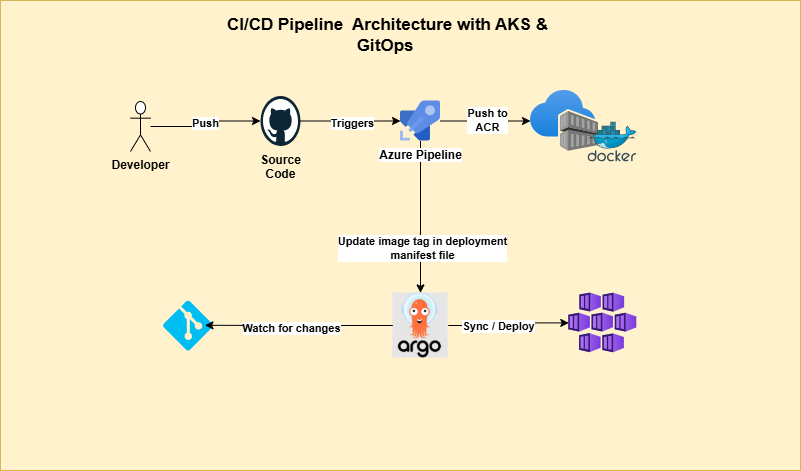
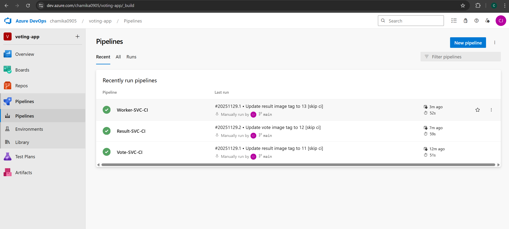
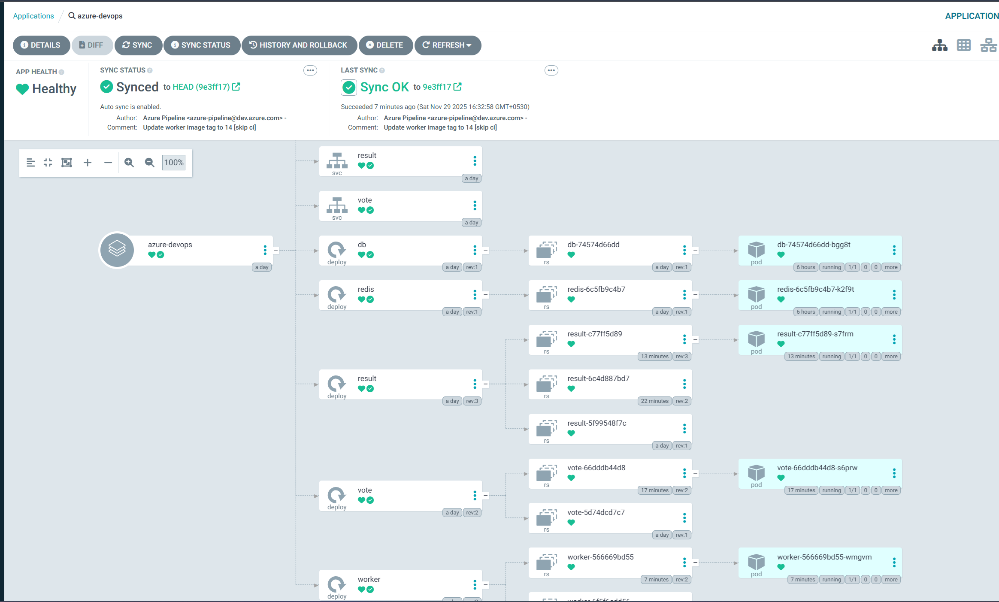
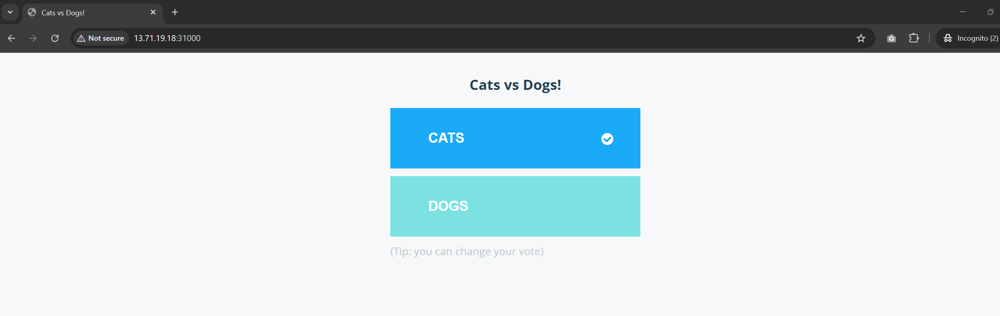
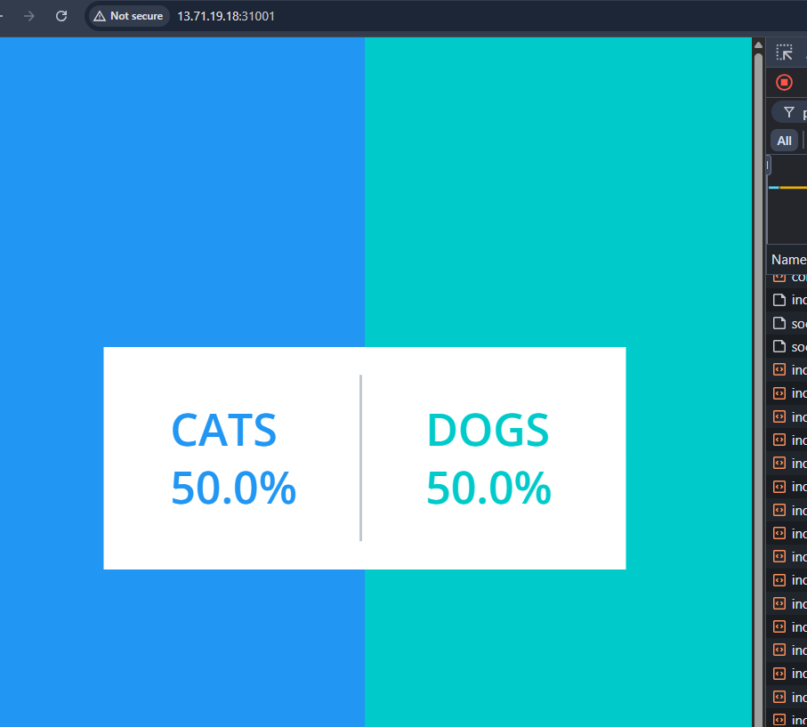

# 🚀 Azure DevOps GitOps CI/CD Pipeline with ArgoCD

[](https://azure.microsoft.com/en-us/products/devops)
[](https://kubernetes.io/)
[](https://argoproj.github.io/cd/)
[](https://www.docker.com/)

A production-ready **CI/CD pipeline** demonstrating **GitOps principles** using **Azure DevOps**, **Azure Kubernetes Service (AKS)**, **Azure Container Registry (ACR)**, and **ArgoCD** for automated deployments.




---

## 📋 Table of Contents

- [Overview](#-overview)
- [Tech Stack](#-tech-stack)
- [Infrastructure Setup](#-infrastructure-setup)
- [Azure DevOps Pipeline Configuration](#-azure-devops-pipeline-configuration)
- [GitOps with ArgoCD](#-gitops-with-argocd)
- [Deployment](#-deployment)
- [Accessing the Application](#-accessing-the-application)

---

## 🎯 Overview

This project implements a complete **CI/CD pipeline** following **GitOps methodology** for a microservices-based voting application. The pipeline automatically:

1. **Builds** Docker images on code changes
2. **Pushes** images to Azure Container Registry
3. **Updates** Kubernetes manifests with new image tags
4. **Deploys** automatically via ArgoCD (GitOps)

> 📌 **Source Application**: Based on the [Docker Example Voting App](https://github.com/dockersamples/example-voting-app)

---

## 🛠 Tech Stack

| Category                    | Technology                     |
| --------------------------- | ------------------------------ |
| **Cloud Platform**          | Microsoft Azure                |
| **Container Orchestration** | Azure Kubernetes Service (AKS) |
| **Container Registry**      | Azure Container Registry (ACR) |
| **CI/CD**                   | Azure DevOps Pipelines         |
| **GitOps**                  | ArgoCD                         |
| **Containerization**        | Docker                         |
| **Database**                | PostgreSQL, Redis              |

---

## 🔧 Infrastructure Setup

### 1. Create Azure Resource Group

```bash
az group create --name votingapp-rg --location eastus
```

### 2. Create Azure Container Registry (ACR)

```bash
az acr create \
  --resource-group votingapp-rg \
  --name VotingAppRegistry \
  --sku Basic
```

### 3. Create Azure Kubernetes Service (AKS)

```bash
az aks create \
  --resource-group votingapp-rg \
  --name azuredevops \
  --node-count 2 \
  --enable-addons monitoring \
  --generate-ssh-keys
```

### 4. Attach ACR to AKS

```bash
az aks update \
  --resource-group votingapp-rg \
  --name azuredevops \
  --attach-acr VotingAppRegistry
```

### 5. Configure kubectl Context

```bash
az aks get-credentials \
  --resource-group votingapp-rg \
  --name azuredevops \
  --overwrite-existing
```

Verify the connection:

```bash
kubectl get nodes
```

### 6. Configure Network Security Group (NSG) for NodePort Access

To access services via NodePort, open the required ports in the AKS node pool's NSG:

```bash
# Get the NSG name associated with AKS nodes
NSG_NAME=$(az network nsg list --resource-group MC_votingapp-rg_azuredevops_eastus --query "[0].name" -o tsv)

# Open NodePort for Vote service (31000)
az network nsg rule create \
  --resource-group MC_votingapp-rg_azuredevops_eastus \
  --nsg-name $NSG_NAME \
  --name AllowVoteNodePort \
  --priority 100 \
  --destination-port-ranges 31000 \
  --access Allow \
  --protocol Tcp

# Open NodePort for Result service (31001)
az network nsg rule create \
  --resource-group MC_votingapp-rg_azuredevops_eastus \
  --nsg-name $NSG_NAME \
  --name AllowResultNodePort \
  --priority 101 \
  --destination-port-ranges 31001 \
  --access Allow \
  --protocol Tcp
```

---

## 🔄 Azure DevOps Pipeline Configuration

### 1. Create Azure DevOps Project

1. Navigate to [Azure DevOps](https://dev.azure.com)
2. Create a new project
3. Import this repository

### 2. Configure Self-Hosted Agent

The pipelines use a self-hosted agent pool (`MyAzureAgentPool`). Set up an Azure VM as an agent:

```bash
# First ssh to the instance and, download and configure the agent
mkdir myagent && cd myagent
wget https://vstsagentpackage.azureedge.net/agent/3.x.x/vsts-agent-linux-x64-3.x.x.tar.gz
tar zxvf vsts-agent-linux-x64-3.x.x.tar.gz
./config.sh
./run.sh
```

### 3. Create Service Connections

1. Go to **Project Settings** → **Service Connections**
2. Create a **Docker Registry** service connection for ACR
3. Note the service connection ID for pipeline configuration

### 4. Pipeline Structure

Three separate pipelines handle each microservice:

| Pipeline                     | Trigger Path | Service        |
| ---------------------------- | ------------ | -------------- |
| `azure-pipelines-vote.yml`   | `vote/**`    | Vote Service   |
| `azure-pipelines-result.yml` | `result/**`  | Result Service |
| `azure-pipelines-worker.yml` | `worker/**`  | Worker Service |



Each pipeline executes three stages:

```yaml
stages:
  - stage: Build # Build Docker image
  - stage: Push # Push to ACR
  - stage: UpdateManifest # Update K8s manifest (GitOps)
```

### 5. GitOps Manifest Update Script

The `scripts/update-manifest.sh` script automatically updates Kubernetes manifests with new image tags:

```bash
# Updates deployment manifest and pushes to git
# Triggers ArgoCD to sync the new deployment
sed -i "s|image: .*|image: ${ACR_REGISTRY}/${SERVICE_NAME}service:${IMAGE_TAG}|g" "$MANIFEST_FILE"
git commit -m "Update ${SERVICE_NAME} image tag to ${IMAGE_TAG} [skip ci]"
git push origin HEAD:main
```

---

## 🔵 GitOps with ArgoCD

### 1. Create ArgoCD Namespace

```bash
kubectl create namespace argocd
```

### 2. Install ArgoCD

```bash
kubectl apply -n argocd \
  -f https://raw.githubusercontent.com/argoproj/argo-cd/stable/manifests/install.yaml
```

### 3. Verify Installation

```bash
# Wait for all pods to be running
kubectl get pods -n argocd -w

# List all ArgoCD resources
kubectl get all -n argocd
```

### 4. Expose ArgoCD Server

Edit the ArgoCD server service to use LoadBalancer:

```bash
kubectl patch svc argocd-server -n argocd -p '{"spec": {"type": "LoadBalancer"}}'
```

Or manually edit:

```bash
kubectl edit svc argocd-server -n argocd
# Change: type: ClusterIP
# To:     type: LoadBalancer
```

### 5. Get ArgoCD External URL

```bash
kubectl get svc argocd-server -n argocd
```

Expected output:

```
NAME            TYPE           CLUSTER-IP     EXTERNAL-IP      PORT(S)
argocd-server   LoadBalancer   10.0.x.x       20.xxx.xxx.xxx   80:xxxxx/TCP,443:xxxxx/TCP
```

### 6. Get ArgoCD Admin Password

```bash
kubectl get secret argocd-initial-admin-secret -n argocd \
  -o jsonpath="{.data.password}" | base64 -d && echo
```

### 7. Login to ArgoCD UI

1. Open browser: `https://<EXTERNAL-IP>`
2. Accept the certificate warning
3. Login with:
   - **Username**: `admin`
   - **Password**: (output from previous command)

### 8. Create Application in ArgoCD

**Via ArgoCD UI:**

1. Click **"+ NEW APP"**
2. Configure:
   - **Application Name**: `voting-app`
   - **Project**: `default`
   - **Sync Policy**: `Automatic`
   - **Repository URL**: `https://github.com/Chamikajaya/Azure-DevOps-GitOps-CI-CD-Project`
   - **Path**: `k8s-specifications`
   - **Cluster URL**: `https://kubernetes.default.svc`
   - **Namespace**: `dev`
3. Click **CREATE**

**Via CLI:**

```bash
argocd app create voting-app \
  --repo https://github.com/Chamikajaya/Azure-DevOps-GitOps-CI-CD-Project \
  --path k8s-specifications \
  --dest-server https://kubernetes.default.svc \
  --dest-namespace dev \
  --sync-policy automated
```

---

## 🚀 Deployment

### 1. Create Application Namespace

```bash
kubectl create namespace dev
```

### 2. Verify Deployment

```bash
# Check all resources in dev namespace
kubectl get all -n dev

# Check deployment status
kubectl get deployments -n dev

# Check pod status
kubectl get pods -n dev
```

### 3. Verify ArgoCD Sync

In ArgoCD UI, verify that all components show **"Synced"** and **"Healthy"** status.



---

## 🌐 Accessing the Application

### Get Node IP Address

```bash
kubectl get nodes -o wide
```

### Access Services

| Service        | URL                      | Port  |
| -------------- | ------------------------ | ----- |
| **Vote App**   | `http://<NODE-IP>:31000` | 31000 |
| **Result App** | `http://<NODE-IP>:31001` | 31001 |




---

## 🔑 Key Features

- ✅ **Fully Automated CI/CD** - Zero manual deployment steps
- ✅ **GitOps Workflow** - Git as single source of truth
- ✅ **Self-Healing Deployments** - ArgoCD auto-syncs desired state
- ✅ **Path-Based Triggers** - Only affected services rebuild on changes

---

## 📄 License

This project is for educational and demonstration purposes. The original voting application is from [Docker Samples](https://github.com/dockersamples/example-voting-app).

---

## 👤 Author

**Chamika Jayasinghe**

[](https://github.com/Chamikajaya)
